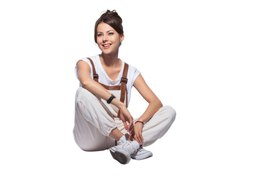

# 🏃‍♂️ Human Pose Estimation

A powerful, interactive application that detects and visualizes human body keypoints and skeletons in real-time. This project leverages the power of **OpenCV DNN** and **Google MediaPipe** to provide accurate pose estimation for both static images and live video streams.



## 🌟 Features

- **Image-Based Estimation:** Upload any image (JPG, JPEG, PNG) and visualize the estimated pose skeleton using OpenCV's DNN module.
- **Real-Time Video Processing:** Utilize MediaPipe for high-performance, real-time pose tracking from video files or live webcam feeds.
- **Interactive Controls:** Adjust detection thresholds on-the-fly using the Streamlit dashboard.
- **Deep Learning Powered:** Uses pre-trained TensorFlow models (`graph_opt.pb`) and MediaPipe's optimized pipelines.

## 🛠️ Tech Stack

- **Frontend:** [Streamlit](https://streamlit.io/)
- **Computer Vision:** [OpenCV](https://opencv.org/), [MediaPipe](https://mediapipe.dev/)
- **Deep Learning:** TensorFlow (Inference via OpenCV DNN)
- **Language:** Python 3.x

## 🚀 Getting Started

### Prerequisites

Ensure you have Python installed. We recommend creating a virtual environment:

```bash
python -m venv venv
source venv/bin/activate  # On Windows: venv\Scripts\activate
```

### Installation

1. Clone the repository:
   ```bash
   git clone https://github.com/yourusername/human-pose-estimation.git
   cd human-pose-estimation
   ```

2. Install the required dependencies:
   ```bash
   pip install streamlit opencv-python mediapipe numpy pillow
   ```

3. Ensure you have the model weights:
   - The project uses `graph_opt.pb` for OpenCV-based detection.

## 🖥️ Usage

### 1. Streamlit Web App (Image Estimation)
Launch the interactive web interface to process static images:

```bash
streamlit run st1_basic.py
```

- **Upload:** Use the sidebar or main area to upload an image.
- **Threshold:** Adjust the slider to fine-tune the confidence level for keypoint detection.
- **Results:** View the original and processed images side-by-side.

### 2. Jupyter Notebook (Video Estimation)
For video processing and MediaPipe-based real-time estimation:

- Open `video_pose.ipynb` in your preferred editor (VS Code, JupyterLab).
- The notebook is configured to process `run1.mp4` by default but can be toggled to use your **Webcam (0)**.

## 📊 Keypoints Detected

The model detects 18 key body parts, including:
- Nose, Neck
- Shoulders (R/L), Elbows (R/L), Wrists (R/L)
- Hips (R/L), Knees (R/L), Ankles (R/L)
- Eyes (R/L), Ears (R/L)

## 📁 Project Structure

```text
.
├── graph_opt.pb          # Pre-trained TensorFlow model weights
├── st1_basic.py          # Streamlit application source code
├── video_pose.ipynb      # MediaPipe video processing notebook
├── run1.mp4              # Sample video for testing
├── stand.jpg             # Sample image for testing
└── README.md             # Project documentation
```

## 🤝 Contributing

Contributions are welcome! If you have ideas for improvements or find any issues, feel free to open a Pull Request or create an Issue.

---
Developed with ❤️ by [Rupkatha]
